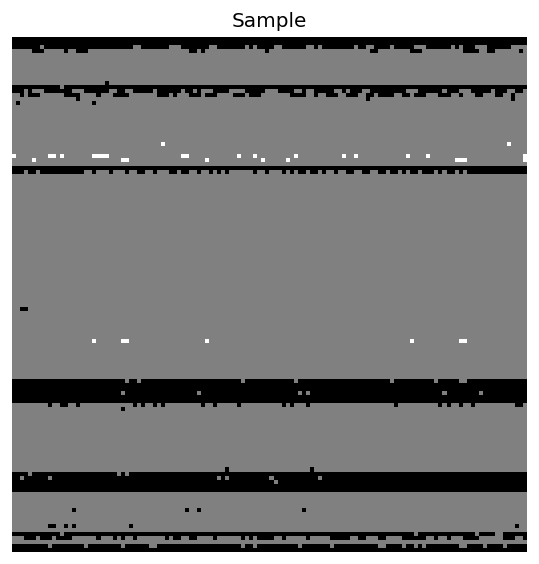
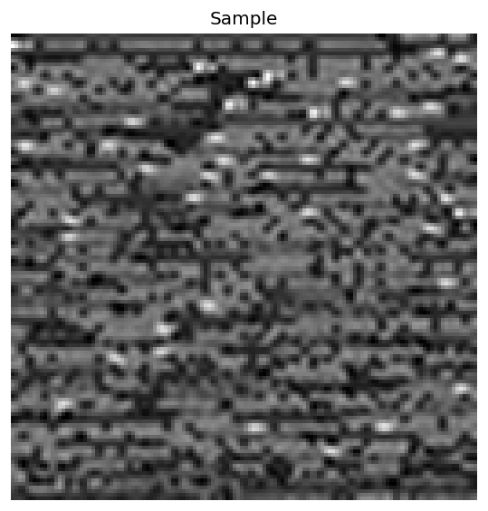
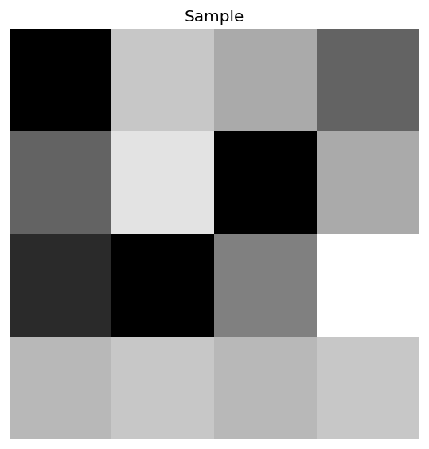

# Solver Selection for SAT and JSSP using CNNs

This project implements convolutional neural network (CNN) models for solver selection in two domains: SAT (Boolean Satisfiability) and JSSP (Job Shop Scheduling Problem). Instances are transformed into image or tensor representations and are used to predict which solver (or set of solvers) is likely to solve a given instance within a time limit.

## Overview

The repository is organised around two main stages:

1. **Data generation** – conversion of problem instances into image or tensor representations and creation of ground-truth CSV files with solver performance metrics.
2. **Training** – CNN-based models trained on those representations to solve classification and multilabel solver-selection tasks (and regression in the SAT case).

All components are configured via YAML files, expose command-line interfaces, and are importable as Python modules.

## Requirements

- Python 3.9+
- MiniZinc CLI (for JSSP data generation only)
- Install dependencies:
  ```bash
  pip install -r requirements.txt
  ```

### Key Dependencies

- TensorFlow 2.19+ / Keras 3.6+
- scikit-learn 1.6+
- PyYAML 6.0+
- pandas, numpy, matplotlib
- OR-Tools (for JSSP)

## Project Structure

```text
├── src/
│   ├── data_generation/          # Data generation pipelines
│   │   ├── jssp_images/          # JSSP → grayscale images (Text-to-Image: model.mzn + .dzn)
│   │   ├── jssp_tensors/         # JSSP → 2D processing-time matrices → padded tensors
│   │   └── sat_images/           # SAT → grayscale images (raw bytes of CNF/XCSP/DZN)
│   └── training/                 # Training pipelines
│       ├── jssp_images/          # Train on JSSP images
│       ├── jssp_tensors/         # Train on JSSP tensors
│       └── sat_images/           # Train on SAT images (SAT-specific metrics)
├── data/                         # Generated datasets
│   ├── jssp/datasets/
│   └── sat/datasets/
├── results/                      # Training outputs
│   ├── jssp/
│   │   ├── images/
│   │   └── tensors/
│   └── sat/
├── models/                       # MiniZinc models for JSSP
└── utils/                        # Utility scripts
```

### Data representations and example images

The following figures (stored at the repository root) illustrate the three data encodings used:

#### SAT image encoding



*sat_image.png*: SAT instance encoded as a grayscale image. The raw bytes of the CNF/XCSP/DZN file are mapped to a 2D array and resized to 128×128. This corresponds to the output of [`src/data_generation/sat_images/image_converter.py`](src/data_generation/sat_images/image_converter.py).

#### JSSP Text-to-Image encoding



*jssp_image.png*: JSSP instance encoded via Text-to-Image. The MiniZinc model [`model.mzn`](models/jssp/model.mzn) is concatenated with the instance data file in `.dzn` format, the combined text is encoded as bytes, reshaped into a square matrix, and resized to 128×128. This corresponds to the output of [`src/data_generation/jssp_images/image_converter.py`](src/data_generation/jssp_images/image_converter.py).

#### JSSP tensor representation



*jssp_tensor.png*: Processing-time matrix (Jobs × Machines) for a JSSP instance, visualised as a heatmap before padding to a fixed tensor of shape `(max_jobs, max_machines, n_channels)`. These matrices are produced by [`src/data_generation/jssp_tensors/tensor_converter.py`](src/data_generation/jssp_tensors/tensor_converter.py) and transformed into padded tensors during training.
 
## Quick Start

### 1. Data Generation

#### JSSP Images (Grayscale 128x128x1)
```bash
# Academic dataset (JSPLIB instances)
python -m src.data_generation.jssp_images.cli \
  --config src/data_generation/jssp_images/config.yaml \
  --mode academic

# Generated dataset (random instances)
python -m src.data_generation.jssp_images.cli \
  --config src/data_generation/jssp_images/config.yaml \
  --mode generated
```

#### JSSP Tensors (3D 10x10x2)
```bash
python -m src.data_generation.jssp_tensors.cli \
  --config src/data_generation/jssp_tensors/config.yaml \
  --mode generated
```

#### SAT Images (Grayscale 128x128x1)
```bash
# Extract instances first
tar -xf data/sat/instances/sc2012-application.tar -C data/sat/instances/

# Generate dataset
python -m src.data_generation.sat_images.cli \
  --config src/data_generation/sat_images/config.yaml \
  --scenario_dir data/sat/aslib/sc2012-application \
  --instances_dir data/sat/instances/sc2012-application
```

### 2. Training

#### JSSP Images
```bash
# Classification (select best solver)
python -m src.training.jssp_images.cli \
  --csv data/jssp/datasets/jssp_cnn_data_images/ground_truth_jsp_generated_dataset.csv \
  --task classification \
  --epochs 30 \
  --folds 5

# Multilabel (identify viable solvers)
python -m src.training.jssp_images.cli \
  --csv data/jssp/datasets/jssp_cnn_data_images/ground_truth_jsp_generated_dataset.csv \
  --task multilabel \
  --epochs 25
```

The CLI supports **classification** and **multilabel** for JSSP images. Regression can still be explored via the Python API, but is not exposed as a CLI task.

#### JSSP Tensors
```bash
python -m src.training.jssp_tensors.cli \
  --csv data/jssp/datasets/jssp_cnn_data_tensors/ground_truth_jsp_generated_dataset.csv \
  --task classification \
  --epochs 30 \
  --folds 5

python -m src.training.jssp_tensors.cli \
  --csv data/jssp/datasets/jssp_cnn_data_tensors/ground_truth_jsp_generated_dataset.csv \
  --task multilabel \
  --epochs 30
```

#### SAT Images (with SAT-specific metrics)
```bash
# Basic classification
python -m src.training.sat_images.cli \
  --csv data/sat/datasets/sat_cnn_data_images/ground_truth_aslib.csv \
  --task classification \
  --epochs 30 \
  --folds 5

# 5x5 cross-validation with time limit
python -m src.training.sat_images.cli \
  --csv data/sat/datasets/sat_cnn_data_images/ground_truth_aslib.csv \
  --task classification \
  --folds 5 \
  --repeats 5 \
  --time_limit 1200

# Filter specific solvers (multilabel)
python -m src.training.sat_images.cli \
  --csv data/sat/datasets/sat_cnn_data_images/ground_truth_aslib.csv \
  --task multilabel \
  --solvers clasp,glucose,lingeling
```

## Supported Tasks

### Classification

Select the single best solver for each instance.

- Metrics: accuracy, macro-F1.
- SAT only: additional resolved_rate and AST metrics.

### Multilabel

Identify all viable solvers (runtime < time_limit) per instance.

- Metrics: micro-F1, macro-F1, average precision.
- SAT only: additional resolved_rate and AST metrics.

### Regression (SAT only)

Predict runtime for each solver.

- Metrics: MAE (mean absolute error).

## Configuration

Each module has a `config.yaml` file with all parameters:

```yaml
# Example: src/training/jssp_images/config.yaml
data:
  image:
    target_height: 128
    target_width: 128
    channels: 1
  time_limit_s: 60.0
  use_score: false

model:
  architecture:
    conv_layers:
      - filters: 16
        kernel_size: 3
        activation: "relu"
        pooling: true
      - filters: 32
        kernel_size: 3
        activation: "relu"
        pooling: true
      - filters: 64
        kernel_size: 3
        activation: "relu"
        pooling: true
    dropout_conv: 0.25
    dense_layers:
      - units: 256
        activation: "relu"
    dropout_dense: 0.5
  learning_rate: 0.001

training:
  epochs: 25
  batch_size: 64
  k_folds: 5
```

All parameters can be overridden via CLI arguments.

## SAT-Specific Features

The SAT training module extends the generic image pipeline with SAT-specific concepts:

- **resolved_rate**: proportion of instances whose predicted solver successfully resolves the instance (according to runtime and/or status).
- **AST (Average Solving Time)**: mean of feature-extraction time plus solver runtime, with the time limit used as a penalty when the solver fails.
- **K-Fold repetitions**: support for repeated cross-validation (e.g., 5×5).
- **Status handling**: uses `*_Status` columns (OK/SAT/UNSAT/TIMEOUT/…) when available.
- **Solver filtering**: selection of specific solvers via the `--solvers` flag.

## Documentation

Each module has comprehensive documentation:
- [`src/data_generation/jssp_images/README.md`](src/data_generation/jssp_images/README.md)
- [`src/data_generation/jssp_tensors/README.md`](src/data_generation/jssp_tensors/README.md)
- [`src/data_generation/sat_images/README.md`](src/data_generation/sat_images/README.md)
- [`src/training/jssp_images/README.md`](src/training/jssp_images/README.md)
- [`src/training/jssp_tensors/README.md`](src/training/jssp_tensors/README.md)
- [`src/training/sat_images/README.md`](src/training/sat_images/README.md)

## Utilities

Key utilities are documented in [`utils/README.md`](utils/README.md):

- [`utils/dataset_imbalance.py`](utils/dataset_imbalance.py): CLI tool to inspect solver/label imbalance and solver viability (classification-style and multilabel-style) in the generated CSVs for SAT and JSSP.
- [`utils/visualize_tensor.py`](utils/visualize_tensor.py): Unified visualiser for `.npy/.npz/.pt/.pth/.pkl` tensors and standard image formats (`.png`, `.jpg`, …), suitable for inspecting SAT images, JSSP images (Text-to-Image) and JSSP tensors.

Example usage:

```bash
# Inspect a JSSP image
python -m utils.visualize_tensor \
  data/jssp/datasets/jssp_cnn_data_images/images/GEN_10x10_1_image.npy

# Inspect a JSSP tensor
python -m utils.visualize_tensor \
  data/jssp/datasets/jssp_cnn_data_tensors/images/GEN_10x10_1_tensor.npy

# Analyse imbalance in a JSSP CSV
python -m utils.dataset_imbalance \
  --csv data/jssp/datasets/jssp_cnn_data_images/ground_truth_jsp_generated_dataset.csv \
  --time-limit 60
```

## Complete Workflows

### JSSP end-to-end

```bash
# Generate JSSP image data (Text-to-Image: model.mzn + .dzn)
python -m src.data_generation.jssp_images.cli --mode generated

# Train model on generated JSSP images
python -m src.training.jssp_images.cli \
  --csv data/jssp/datasets/jssp_cnn_data_images/ground_truth_jsp_generated_dataset.csv \
  --task classification \
  --epochs 30 \
  --folds 5
```

### SAT end-to-end

```bash
# Extract and generate data
tar -xf data/sat/instances/sc2012-application.tar -C data/sat/instances/
python -m src.data_generation.sat_images.cli \
  --scenario_dir data/sat/aslib/sc2012-application \
  --instances_dir data/sat/instances/sc2012-application

# Train with 5x5 cross-validation
python -m src.training.sat_images.cli \
  --csv data/sat/datasets/sat_cnn_data_images/ground_truth_aslib.csv \
  --task classification \
  --folds 5 \
  --repeats 5 \
  --time_limit 1200
```

## Common Issues

### "CSV doesn't have 'Image_Npy_Path'"
Run data generation first to create the CSV with image paths.

### "No valid images found"
- Execute commands from project root
- Regenerate CSV if you moved files

### MiniZinc errors (JSSP only)
```bash
# Verify installation
minizinc --version
minizinc --solvers

# Ensure gecode or chuffed is available
```

### Import errors
```bash
# Reinstall dependencies
pip install -r requirements.txt
```

## Output Structure

### Data generation

```text
data/[jssp|sat]/datasets/[dataset_name]/
├── ground_truth*.csv         # Main dataset file
├── images/                   # .npy image/tensor files
│   ├── instance1.npy
│   └── instance2.npy
└── [instances]/              # Original instance files (.dzn, .cnf, .xml, ...)
```

### Training

```text
results/[jssp|sat]/[images|tensors]/[run_name_timestamp]/
├── config.yaml               # Configuration used
├── run_info.json             # Run metadata
├── metrics_summary.json      # Aggregated results (per run or per repeat)
├── metrics_per_fold.csv      # Per-fold details
├── [metric]_per_fold.png     # Cross-fold visualisation
└── fold_1/                   # Individual fold results
    ├── fold1_metrics.json
    ├── fold1_y_true.npy
    ├── fold1_y_pred.npy
    ├── fold1_confusion.png
    └── ...
```

## Architecture

### JSSP Images CNN

- Input: 128×128×1 grayscale images (Text-to-Image encoding of `model.mzn + .dzn`).
- Architecture: 3 Conv2D blocks (16→32→64 filters) followed by a dense layer with 256 units.
- Tasks (CLI): classification and multilabel. Regression is supported via the Python API.

### JSSP Tensors CNN

- Input: `(max_jobs, max_machines, n_channels)` tensors (default 10×10×2), obtained by padding variable-size processing-time matrices.
- Architecture: 3 Conv2D blocks (32→64→128 filters) followed by a dense layer with 256 units.
- Tasks (CLI): classification and multilabel.

### SAT Images CNN

- Input: 128×128×1 grayscale images (raw-byte encoding of SAT instances).
- Architecture: same as JSSP images.
- Tasks (CLI): classification, multilabel, regression.
- Additional SAT metrics: resolved_rate and AST (Average Solving Time).

## License

Part of the solver selection research project.

## Contributing

This is a research project. For questions or issues, please refer to the module-specific READMEs.

## Support

- Check module READMEs for detailed documentation
- Review configuration files for available parameters
- Use `--help` flag on any CLI for usage information

```bash
python -m src.training.jssp_images.cli --help